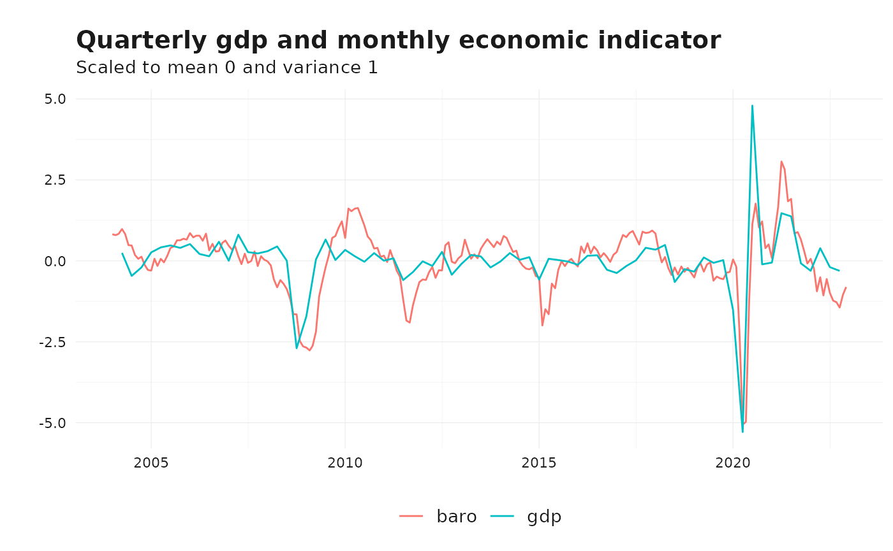
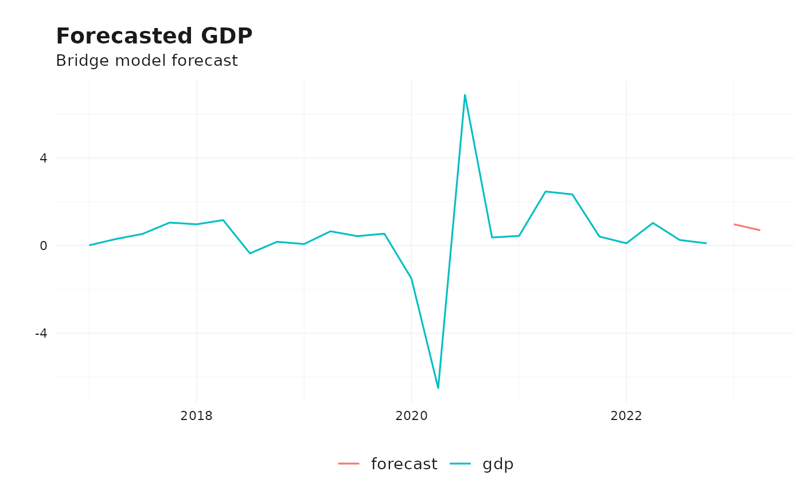

# Introduction to bridgr

## What Are Bridge Models?

Bridge models are statistical tools designed to address the mismatch in
frequency between economic indicators and a target variable, such as
GDP. For instance, GDP is typically reported quarterly, while many
relevant indicators (e.g., industrial production, survey data) are
available monthly or even daily. Bridge models “bridge” this gap by
converting high-frequency indicators into a form that aligns with the
target variable’s frequency.

These models are widely used in nowcasting and short-term forecasting.
They are particularly useful when:

- Data for the target variable is reported with a lag (e.g., GDP is
  often released with a delay).
- High-frequency indicators provide early signals about the state of the
  economy.

By leveraging real-time data, bridge models can improve forecast
accuracy and provide timely insights.

## The Bridge Model Framework

Bridge models exploit the relationship between a target variable, such
as quarterly GDP (\\y_t\\), and multiple high-frequency indicators
(\\x\_{t}^{(i)}\\), which are observed monthly or at even higher
frequencies. The primary challenge is to harmonize these different
frequencies while preserving the information embedded in the indicators.

### Aggregation of Indicators

To align high-frequency indicators (\\x\_{t}^{(i)}\\) with the target
variable’s frequency (\\y_t\\), a transformation or aggregation process
is applied. Let \\K\\ represent the number of higher-frequency periods
within a single lower-frequency period (e.g., \\K=3\\ for monthly data
aggregated to a quarter). The aggregation step can be represented as:

\\ \bar{x}\_{t}^{(i)} = \sum\_{k=0}^{K-1} \omega (k) L^{k/K}
x\_{t}^{(i)} \\

where:

- The lag operator is defined as \\L^{1/3} x\_{t}^{(i)} =
  x\_{t-1/3}^{(i)}\\

- \\x\_{t}^{(i)}\\: The value of the indicator \\i\\ of period \\t\\.

- \\\bar{x}\_{t}^{(i)}\\: The aggregated indicator for period \\t\\.

- \\\omega (k)\\: The weight assigned to the k-th period of the higher
  frequency data.

In many applications, \\\omega (k)\\ is simply an **average** over the
values in the higher frequency periods. Alternative aggregation
techniques include taking the **last observation** (e.g., the last month
of the quarter), applying fixed **weighted averages**, or estimating
exponential-Almon weights from the data.

In `bridgr`, the supported aggregation choices are:

- `"mean"`
- `"last"`
- `"sum"`
- numeric weights supplied in `list(...)`
- `"expalmon"`

When `"expalmon"` is used for more than one indicator, the package
estimates those weight profiles jointly against the final bridge-model
objective. This avoids choosing each weighting profile in isolation.

### The Model Specification

Once the indicators are aligned with the target frequency, the bridge
model is typically specified as a linear regression:

\\ y_t = \beta_0 + \sum\_{ i } \sum\_{p_i=0}^{P^{(i)}} \beta\_{p_i} L^p
\bar{x}\_{t}^{(i)} + \varepsilon_t \\

where:

- \\P^{(i)}\\: The lags to include for indicator \\i\\.

- \\\beta\_{p_i}\\: Coefficients capturing the relationship between the
  indicators and the target variable.

- \\\varepsilon_t\\: The error term.

Bridge models also handle cases where some high-frequency indicators are
not fully observed at the time of forecasting. In such cases, missing
observations for the current period are imputed or forecast using time
series models (e.g., ARIMA, ETS). This allows predictions even when
recent observations are missing. This combination of aggregation and
forecasting ensures that bridge models are versatile tools for dealing
with incomplete data scenarios.

The package assumes a regular frequency ladder from `second` to `year`,
with default mappings such as `60` seconds per minute, `7` days per
week, and `4` weeks per month. These defaults can be adjusted through
`frequency_conversions`. If a target period contains more high-frequency
observations than implied by the current mapping, `bridgr` uses the most
recent observations and issues a summarized warning. If it contains
fewer observations than required, estimation stops with an error.

## A Quick Example

The `bridgr` package simplifies the construction and estimation of
bridge models. This vignette demonstrates how to use the package with a
quarterly GDP series (gdp) and a monthly economic indicator (baro).

### Loading the Data

For this example, the two follwoing Swiss datasets are used:

- `gdp`: Quarterly GDP data.
- `baro`: Monthly economic indicator data.

``` r
# Load libraries
library(bridgr)
library(tsbox)

# Example data
data("gdp")  # Quarterly GDP data
data("baro") # Monthly economic indicator

gdp <- tsbox::ts_na_omit(tsbox::ts_pc(gdp)) # Calculate growth rate

# Visualize the data
ts_ggplot(
  ts_scale(ts_c(baro, gdp)),
  title = "Quarterly gdp and monthly economic indicator",
  subtitle = "Scaled to mean 0 and variance 1"
  ) +
  theme_tsbox()
```



By visualizing the data,it becomes obvious that the monthly economic
indicator (baro) is available at a higher frequency than the quarterly
GDP data. Moreover, there is a significant correlation.

### Estimating the Bridge Model

``` r
# Estimate the bridge model
bridge_model <- bridge(
  target = gdp, 
  indic = baro , 
  indic_predict = "auto.arima",
  indic_aggregators = "mean",
  indic_lags = 1, 
  target_lags=1, 
  h=2 
)
#> [value]: 'values' 
#> [value]: 'values'
```

Because by calculating the GDP growth rate, there is one observation
less at the beginning of the GDP series. The
[`bridge()`](https://marcburri.github.io/bridgr/reference/bridge.md)
function detects mismatched starting dates and aligns them to the
earliest common date. The model is then estimated using the specified
lags for the target and indicator variables. The `h` argument specifies
the number of periods to forecast the lower frequency variable. The
fitted object returns both the target-frequency estimation sample and
the forecast-period regressor set used for prediction.

``` r
# Inspect the datasets
tail(bridge_model$estimation_set)
#> # A tibble: 6 × 4
#>   time         gdp  baro baro_lag1
#>   <date>     <dbl> <dbl>     <dbl>
#> 1 2021-07-01 2.34  112.      125. 
#> 2 2021-10-01 0.411 104.      112. 
#> 3 2022-01-01 0.105  97.4     104. 
#> 4 2022-04-01 1.03   94.3      97.4
#> 5 2022-07-01 0.255  90.0      94.3
#> 6 2022-10-01 0.102  90.7      90.0
head(bridge_model$forecast_set)
#> # A tibble: 2 × 3
#>   time        baro baro_lag1
#>   <date>     <dbl>     <dbl>
#> 1 2023-01-01  97.4      90.7
#> 2 2023-04-01  99.8      97.4
```

### Forecasting

``` r
# Forecasting using the bridge model
fcst <- forecast(bridge_model)

forecast <- data.frame(
  "time" = fcst$forecast_set$time,
  "forecast" = as.numeric(fcst$mean)
)

# Visualize the forecast
ts_ggplot(
  ts_span(ts_tbl(ts_c(gdp, forecast)), start = 2017),
  title = "Forecasted GDP",
  subtitle = "Bridge model forecast"
) +
  theme_tsbox()
```



### Summary

``` r
# Summarize the information in the bridge model
summary(bridge_model)
#> Bridge model summary
#> -----------------------------------
#> Target series: gdp
#> Target frequency: quarter (step 1)
#> Forecast horizon: 2
#> Formula: gdp ~ baro + baro_lag1
#> -----------------------------------
#> Main model:
#> -----------------------------------
#> Series: estimation_xts[, target_name] 
#> Regression with ARIMA(1,0,0) errors 
#> 
#> Coefficients:
#>          ar1  intercept    baro  baro_lag1
#>       0.2426    -6.4929  0.1615    -0.0917
#> s.e.  0.1213     1.3430  0.0125     0.0121
#> 
#> sigma^2 = 0.5625:  log likelihood = -81.69
#> AIC=173.38   AICc=174.26   BIC=184.9
#> -----------------------------------
#> Indicator models:
#> -----------------------------------
#> Series: baro
#> Frequency: month (step 1)
#> Forecast method: auto.arima
#> Series: xts_series 
#> ARIMA(1,0,2) with non-zero mean 
#> 
#> Coefficients:
#>          ar1     ma1     ma2      mean
#>       0.6688  0.5305  0.3316  100.8580
#> s.e.  0.0653  0.0799  0.0753    1.5774
#> 
#> sigma^2 = 18.46:  log likelihood = -646.14
#> AIC=1302.28   AICc=1302.55   BIC=1319.36
#> Aggregation: mean
#> -----------------------------------
```

### Using `expalmon` Aggregation

If you want the within-period weights to be estimated from the data
rather than fixed at a simple mean, you can use
`indic_aggregators = "expalmon"`. The optimizer can be controlled with
`solver_options`.

``` r
expalmon_model <- bridge(
  target = gdp,
  indic = baro,
  indic_predict = "auto.arima",
  indic_aggregators = "expalmon",
  solver_options = list(seed = 123, n_starts = 3),
  h = 1
)

summary(expalmon_model)
#> Bridge model summary
#> -----------------------------------
#> Target series: gdp
#> Target frequency: quarter (step 1)
#> Forecast horizon: 1
#> Formula: gdp ~ baro
#> -----------------------------------
#> Main model:
#> -----------------------------------
#> Series: estimation_xts[, target_name] 
#> Regression with ARIMA(0,0,0) errors 
#> 
#> Coefficients:
#>       intercept    baro
#>         -9.3713  0.0982
#> s.e.     1.0730  0.0106
#> 
#> sigma^2 = 0.8333:  log likelihood = -98.57
#> AIC=203.14   AICc=203.48   BIC=210.09
#> -----------------------------------
#> Indicator models:
#> -----------------------------------
#> Series: baro
#> Frequency: month (step 1)
#> Forecast method: auto.arima
#> Series: xts_series 
#> ARIMA(1,0,2) with non-zero mean 
#> 
#> Coefficients:
#>          ar1     ma1     ma2      mean
#>       0.6688  0.5305  0.3316  100.8580
#> s.e.  0.0653  0.0799  0.0753    1.5774
#> 
#> sigma^2 = 18.46:  log likelihood = -646.14
#> AIC=1302.28   AICc=1302.55   BIC=1319.36
#> Aggregation: expalmon
#> Estimated expalmon weights: 0.006, 0.994, 0
#> Estimated expalmon parameters: -4.914, -10
#> -----------------------------------
#> Joint expalmon optimization:
#> -----------------------------------
#> Method: L-BFGS-B
#> Objective value: 60.8316
#> Convergence code: 0
#> Best start: 1 / 3
#> Message: CONVERGENCE: REL_REDUCTION_OF_F <= FACTR*EPSMCH
#> -----------------------------------
```

For single-indicator models this gives a data-driven weighting profile
for the high-frequency observations within each target period. For
multi-indicator models, all `expalmon` indicators are optimized jointly
so that the weighting scheme is chosen for the bridge equation as a
whole.
