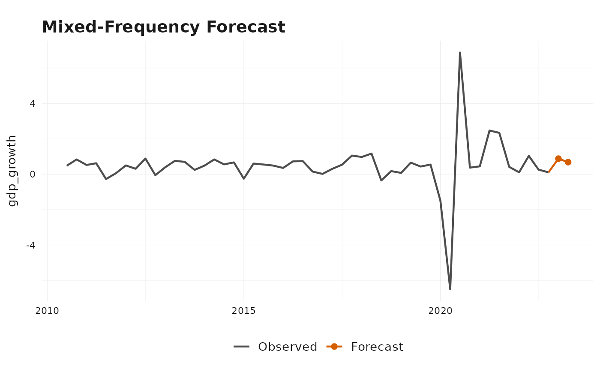
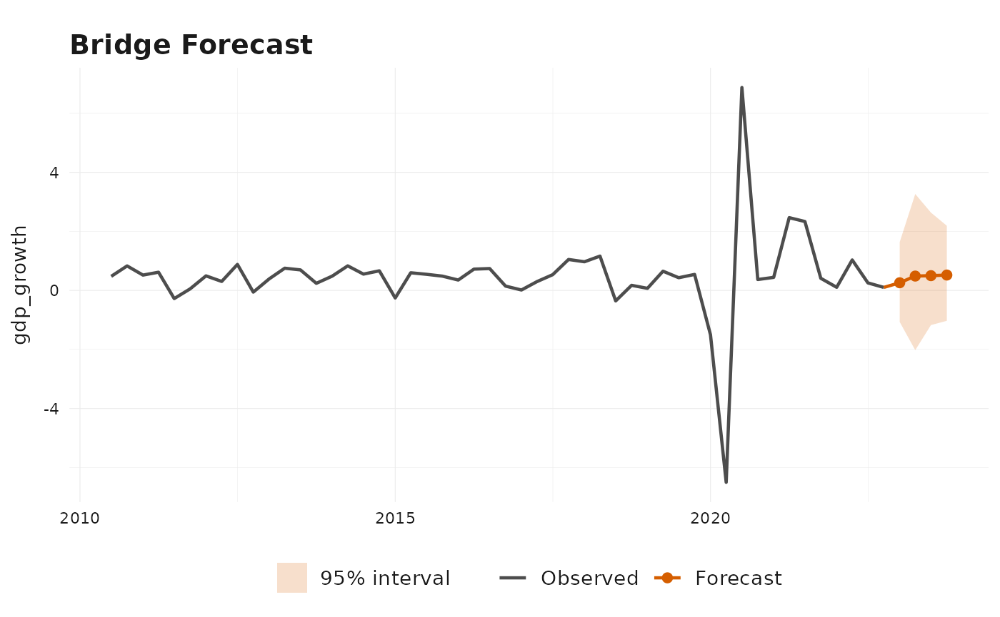

# Getting Started with bridgr

## Overview

`bridgr` is a mixed-frequency forecasting package for bridge models,
MIDAS-style regressions, and intermediate specifications that estimate
within-period weights from the data.

The core workflow is always the same:

1.  Provide one lower-frequency target series and one or more
    higher-frequency indicators.
2.  Decide how missing indicator observations should be handled with
    `indic_predict`.
3.  Decide how indicators should be aligned to the target frequency with
    `indic_aggregators`.
4.  Fit the target equation with
    [`bridge()`](https://marcburri.github.io/bridgr/reference/bridge.md),
    inspect it with [`summary()`](https://rdrr.io/r/base/summary.html),
    and produce target-period forecasts with
    [`forecast()`](https://generics.r-lib.org/reference/forecast.html).

This vignette walks through that workflow with the package’s built-in
Swiss GDP and barometer data.

## Example Data

``` r
gdp_growth <- suppressMessages(tsbox::ts_na_omit(tsbox::ts_pc(gdp)))

head(gdp_growth)
#> # A tibble: 6 × 2
#>   time       values
#>   <date>      <dbl>
#> 1 2004-04-01  0.839
#> 2 2004-07-01 -0.104
#> 3 2004-10-01  0.242
#> 4 2005-01-01  0.860
#> 5 2005-04-01  1.06 
#> 6 2005-07-01  1.15
head(baro)
#> # A tibble: 6 × 2
#>   time       values
#>   <date>      <dbl>
#> 1 2004-01-01   109.
#> 2 2004-02-01   108.
#> 3 2004-03-01   109.
#> 4 2004-04-01   110.
#> 5 2004-05-01   109.
#> 6 2004-06-01   105.
```

`gdp_growth` is quarterly, while `baro` is monthly.
[`bridge()`](https://marcburri.github.io/bridgr/reference/bridge.md)
recognizes the frequency mismatch automatically and aligns the indicator
to the target frequency before fitting the target equation.

## A Basic Bridge Model

``` r
bridge_model <- bridge(
  target = gdp_growth,
  indic = baro,
  indic_predict = "auto.arima",
  indic_aggregators = "mean",
  indic_lags = 1,
  target_lags = 1,
  h = 2
)

forecast(bridge_model)
#> Bridge forecast
#> -----------------------------------
#> Target series: gdp_growth
#> Forecast horizon: 2
#> Uncertainty: point forecast only
#> -----------------------------------
#>   time       mean 
#> 1 2023-01-01 0.875
#> 2 2023-04-01 0.678
```

The default mean aggregator is the classic bridge-model setup: each
monthly block is completed first, then averaged to the quarterly
frequency before the target equation is estimated.

The fitted object stores the aligned data that went into estimation and
the future target-period regressor path used for forecasting.

``` r
tail(bridge_model$estimation_set)
#> # A tibble: 6 × 5
#>   time       gdp_growth  baro baro_lag1 gdp_growth_lag1
#>   <date>          <dbl> <dbl>     <dbl>           <dbl>
#> 1 2021-07-01      2.34  112.      125.            2.47 
#> 2 2021-10-01      0.411 104.      112.            2.34 
#> 3 2022-01-01      0.105  97.4     104.            0.411
#> 4 2022-04-01      1.03   94.3      97.4           0.105
#> 5 2022-07-01      0.255  90.0      94.3           1.03 
#> 6 2022-10-01      0.102  90.7      90.0           0.255
bridge_model$forecast_set
#> # A tibble: 2 × 4
#>   time        baro baro_lag1 gdp_growth_lag1
#>   <date>     <dbl>     <dbl> <list>         
#> 1 2023-01-01  97.4      90.7 <dbl [1]>      
#> 2 2023-04-01  99.8      97.4 <dbl [1]>
```

## Standardized Output

[`summary()`](https://rdrr.io/r/base/summary.html) and
[`forecast()`](https://generics.r-lib.org/reference/forecast.html) use a
stable package-specific layout. The base output is the same across
bridge, mixed-frequency, and direct-alignment specifications. Additional
details, such as optimization summaries or uncertainty settings, are
appended only when they are relevant.

``` r
summary(bridge_model)
#> Bridge model summary
#> -----------------------------------
#> Target series: gdp_growth
#> Target frequency: quarter
#> Forecast horizon: 2
#> Estimation rows: 73
#> Regressors: baro, baro_lag1, gdp_growth_lag1
#> -----------------------------------
#> Target equation coefficients:
#>                 Estimate
#> (Intercept)       -6.249
#> baro               0.151
#> baro_lag1         -0.084
#> gdp_growth_lag1    0.012
#> -----------------------------------
#> Indicator summary:
#>      Frequency Predict    Aggregation
#> baro month     auto.arima mean       
#> -----------------------------------
```

## Forecast Visualization

The package also provides a built-in plotting method for fitted bridge
models. With `type = "forecast"`, it shows the observed target history
together with the forecast path generated by the model.

``` r
plot(bridge_model, type = "forecast")
```



## Direct Alignment

If you set `indic_predict = "direct"`, `bridgr` switches from indicator
forecasting to direct alignment based only on observed complete
high-frequency blocks. In that case, the latest complete blocks are
assigned backward to target periods instead of being forecast forward
first, and they are averaged within each target period.

``` r
direct_model <- bridge(
  target = gdp_growth,
  indic = baro,
  indic_predict = "direct",
  h = 1
)

forecast(direct_model)
#> Bridge forecast
#> -----------------------------------
#> Target series: gdp_growth
#> Forecast horizon: 1
#> Uncertainty: point forecast only
#> -----------------------------------
#>   time       mean 
#> 1 2023-01-01 0.483
```

This is particularly useful at the ragged edge when you want to work
only with observed high-frequency information and avoid a separate
indicator forecasting step.

## Optional Uncertainty Output

By default, `bridgr` returns point forecasts only. If you want
uncertainty output, request it at estimation time with `se = TRUE` and,
if needed, custom simulation or full-system bootstrap controls through
`bootstrap`.

``` r
uncertainty_model <- bridge(
  target = gdp_growth,
  indic = baro,
  indic_predict = "auto.arima",
  indic_aggregators = "mean",
  target_lags = 1,
  h = 4,
  se = TRUE,
  bootstrap = list(N = 40, block_length = NULL)
)

forecast(uncertainty_model)
#> Bridge forecast
#> -----------------------------------
#> Target series: gdp_growth
#> Forecast horizon: 4
#> Uncertainty: prediction intervals from residual resampling
#> Simulation paths: 40
#> -----------------------------------
#>   time       mean  se    lower_80 upper_80 lower_95 upper_95
#> 1 2023-01-01 0.259 0.746 -0.850   1.230    -1.069   1.638   
#> 2 2023-04-01 0.486 1.097 -0.433   1.761    -2.025   3.268   
#> 3 2023-07-01 0.500 0.827 -0.441   1.370    -1.174   2.638   
#> 4 2023-10-01 0.521 0.884 -0.532   1.731    -1.030   2.191
summary(uncertainty_model)
#> Bridge model summary
#> -----------------------------------
#> Target series: gdp_growth
#> Target frequency: quarter
#> Forecast horizon: 4
#> Estimation rows: 74
#> Regressors: baro, gdp_growth_lag1
#> -----------------------------------
#> Target equation coefficients:
#>                 Estimate HAC SE
#> (Intercept)      -10.988  3.304
#> baro               0.116  0.033
#> gdp_growth_lag1   -0.316  0.120
#> -----------------------------------
#> Indicator summary:
#>      Frequency Predict    Aggregation
#> baro month     auto.arima mean       
#> -----------------------------------
#> Uncertainty:
#> Coefficient SEs: hac
#> Prediction intervals: residual resampling
#> Simulation paths: 40
#> -----------------------------------
plot(uncertainty_model, type = "forecast")
```



The uncertainty implementation uses HAC standard errors for the linear
bridge equation, or Delta-HAC standard errors when parametric
aggregation weights are estimated jointly. By default, prediction
intervals are simulated from resampled centered target-equation
residuals. If you also set `full_system_bootstrap = TRUE`, `bridgr`
instead uses a full-system target-period block bootstrap for both
coefficient standard errors and prediction intervals, controlled through
`bootstrap = list(N = ..., block_length = ...)`.

## Where to Go Next

The vignette
[`vignette("mixed-frequency-modeling", package = "bridgr")`](https://marcburri.github.io/bridgr/articles/mixed-frequency-modeling.md)
compares the main aggregation strategies and shows how `bridgr` moves
from classic bridge models to unrestricted and parametric MIDAS-style
specifications.

The vignette
[`vignette("ragged-edge-nowcasting", package = "bridgr")`](https://marcburri.github.io/bridgr/articles/ragged-edge-nowcasting.md)
focuses on `indic_predict` and the different ways to handle incomplete
high-frequency data at the forecast origin.

The vignette
[`vignette("uncertainty-and-scenarios", package = "bridgr")`](https://marcburri.github.io/bridgr/articles/uncertainty-and-scenarios.md)
shows how to work with HAC / Delta-HAC coefficient uncertainty,
residual-resampling prediction intervals, the optional full-system
bootstrap, and scenario forecasts based on custom future regressor
paths.
