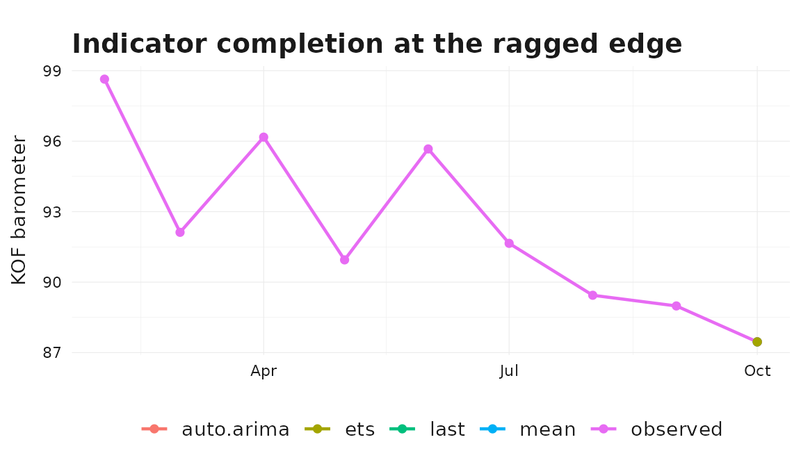

# Ragged-Edge Nowcasting with bridgr

## Why Ragged Edges Matter

Mixed-frequency nowcasting usually happens at the ragged edge: the
lower-frequency target has not been released yet, and the
higher-frequency indicators are only partially observed for the current
target period.

`bridgr` handles that situation through `indic_predict`, which controls
how the missing high-frequency tail is completed before the target
equation is estimated or forecast.

The currently supported options are:

- `"last"`: extend the latest available high-frequency observation.
- `"mean"`: extend the mean of the latest available high-frequency
  block.
- `"auto.arima"`: fit an automatic ARIMA model to each indicator and
  forecast the missing observations.
- `"ets"`: fit an ETS model to each indicator and forecast the missing
  observations.
- `"direct"`: do not forecast the indicator at all. Instead, align the
  latest observed complete high-frequency blocks directly to the target
  periods and average them within each target period.

## A Ragged-Edge Example

We start from the package’s quarterly GDP growth series and monthly
barometer, then remove the last quarterly GDP observation and the last
two monthly indicator observations. That creates a clean nowcast setup:
the final quarter is now forecasted rather than estimated, and the
monthly indicator is only partially observed for that forecast quarter.

``` r

gdp_growth <- suppressMessages(tsbox::ts_na_omit(tsbox::ts_pc(gdp)))
gdp_nowcast <- gdp_growth |>
  dplyr::slice_head(n = nrow(gdp_growth) - 1)

baro_ragged <- baro |>
  dplyr::slice_head(n = nrow(baro) - 2)

tail(gdp_growth)
#> # A tibble: 6 × 2
#>   time       values
#>   <date>      <dbl>
#> 1 2021-07-01  2.34 
#> 2 2021-10-01  0.411
#> 3 2022-01-01  0.105
#> 4 2022-04-01  1.03 
#> 5 2022-07-01  0.255
#> 6 2022-10-01  0.102
tail(gdp_nowcast)
#> # A tibble: 6 × 2
#>   time       values
#>   <date>      <dbl>
#> 1 2021-04-01  2.47 
#> 2 2021-07-01  2.34 
#> 3 2021-10-01  0.411
#> 4 2022-01-01  0.105
#> 5 2022-04-01  1.03 
#> 6 2022-07-01  0.255
tail(baro_ragged)
#> # A tibble: 6 × 2
#>   time       values
#>   <date>      <dbl>
#> 1 2022-05-01   90.9
#> 2 2022-06-01   95.7
#> 3 2022-07-01   91.7
#> 4 2022-08-01   89.4
#> 5 2022-09-01   89.0
#> 6 2022-10-01   87.5
```

The target history now ends one quarter earlier, while the monthly
indicator contains only a partial block for the quarter we want to
nowcast.

## Comparing Indicator Completion Rules

``` r

predict_methods <- c("last", "mean", "auto.arima", "ets")

models <- lapply(
  predict_methods,
  function(method) {
    mf_model(
      target = gdp_nowcast,
      indic = baro_ragged,
      indic_predict = method,
      indic_aggregators = "mean",
      target_lags = 1,
      h = 1
    )
  }
)
names(models) <- predict_methods

forecast_df <- dplyr::bind_rows(
  lapply(predict_methods, function(method) {
    fc <- forecast(models[[method]])
    dplyr::tibble(
      method = method,
      forecast_time = fc$time,
      forecast = as.numeric(fc$mean)
    )
  })
)

forecast_df
#> # A tibble: 4 × 3
#>   method     forecast_time forecast
#>   <chr>      <date>           <dbl>
#> 1 last       2022-10-01      -0.968
#> 2 mean       2022-10-01      -0.876
#> 3 auto.arima 2022-10-01      -0.706
#> 4 ets        2022-10-01      -0.968
```

The model specification is the same in each case. The only difference is
how the missing monthly observations are completed before the indicator
is aggregated to the quarterly frequency.

### Visualizing the completed indicator paths

The plot below shows the tail of the observed monthly indicator together
with the two extrapolated months that each `indic_predict` rule produces
for the partially observed forecast quarter.

``` r

last_obs <- max(baro_ragged$time)
last_obs_value <- baro_ragged$values[baro_ragged$time == last_obs]
future_months <- seq(last_obs, by = "month", length.out = 3)[-1]

observed_tail <- baro_ragged |>
  dplyr::slice_tail(n = 9) |>
  dplyr::transmute(
    time = .data$time,
    value = .data$values,
    method = "observed"
  )

extended <- dplyr::bind_rows(
  lapply(predict_methods, function(method) {
    indicator_tbl <- models[[method]]$indic
    extension <- indicator_tbl |>
      dplyr::filter(.data$time %in% future_months) |>
      dplyr::transmute(
        time = .data$time,
        value = .data$values,
        method = method
      )
    # join to the last observed point for a continuous line
    dplyr::bind_rows(
      dplyr::tibble(time = last_obs, value = last_obs_value, method = method),
      extension
    )
  })
)

ggplot2::ggplot(
  dplyr::bind_rows(observed_tail, extended),
  ggplot2::aes(x = .data$time, y = .data$value, color = .data$method)
) +
  ggplot2::geom_line(linewidth = 0.8) +
  ggplot2::geom_point(size = 1.6) +
  ggplot2::labs(
    title = "Indicator completion at the ragged edge",
    x = NULL,
    y = "KOF barometer",
    color = NULL
  ) +
  theme_bridgr()
```



The differences across rules are exactly what their names suggest:
`"last"` holds the last value flat, `"mean"` extends the mean of the
recent block, and `auto.arima` / `ets` produce model-based paths.

## Direct Alignment

`"direct"` takes a different route. The indicator is not forecasted.
Instead, `bridgr` assigns the latest complete high-frequency blocks
*backward* to the target periods and averages them within each target
period.

``` r

direct_model <- mf_model(
  target = gdp_nowcast,
  indic = baro_ragged,
  indic_predict = "direct",
  h = 1
)

forecast(direct_model)
#> Mixed-frequency forecast
#> -----------------------------------
#> Target series: gdp_nowcast
#> Forecast horizon: 1
#> Uncertainty: point forecast only
#> -----------------------------------
#>   time       mean  
#> 1 2022-10-01 -0.150
```

This is especially useful when you want to avoid a separate indicator
forecasting step and prefer to work only with observed high-frequency
data.

## Explicit Missing Values

Real-time indicator data sometimes contain explicit `NA` cells inside
the sample, for example because of late releases or reporting holidays.
Implicit ragged edges (a shorter indicator tail with no `NA` cells) are
always supported through `indic_predict`. By default `bridgr` errors on
explicit `NA` values; the `missing` argument controls what to do
instead.

`missing = "impute"` interpolates linearly inside each series and is the
most generally useful choice. The example below introduces a single
internal gap and re-fits the model under both `"error"` (default,
captured here) and `"impute"`.

``` r

baro_internal_na <- baro_ragged
internal_gap <- seq(nrow(baro_internal_na) - 14, nrow(baro_internal_na) - 13)
baro_internal_na$values[internal_gap] <- NA_real_

invisible(tryCatch(
  mf_model(
    target = gdp_nowcast,
    indic = baro_internal_na,
    indic_predict = "last",
    indic_aggregators = "mean",
    h = 1
  ),
  error = function(e) message("Error captured: ", conditionMessage(e))
))
#> Error captured: `indic` contains missing values.

imputed_model <- mf_model(
  target = gdp_nowcast,
  indic = baro_internal_na,
  indic_predict = "last",
  indic_aggregators = "mean",
  h = 1,
  missing = "impute"
)
#> Warning in mf_model(target = gdp_nowcast, indic = baro_internal_na,
#> indic_predict = "last", : `indic` contains 2 missing values; imputing them by
#> linear interpolation within each series.

forecast(imputed_model)
#> Mixed-frequency forecast
#> -----------------------------------
#> Target series: gdp_nowcast
#> Forecast horizon: 1
#> Uncertainty: point forecast only
#> -----------------------------------
#>   time       mean  
#> 1 2022-10-01 -0.897
```

`missing = "drop"` removes `NA` rows entirely and is useful when those
rows do not break the per-period completeness required by the inferred
frequency ladder — for example when they sit beyond the estimation
sample. In most ragged-edge workflows `indic_predict` is the better
mechanism for handling trailing gaps.

## When to Use Which Option

As a rough guide:

- Use `"last"` when a simple carry-forward rule is acceptable.
- Use `"mean"` when you want a stable deterministic fill based on the
  latest high-frequency block.
- Use `"auto.arima"` or `"ets"` when the indicator has meaningful
  time-series structure and a separate extrapolation step is sensible.
- Use `"direct"` when you want direct alignment without indicator
  forecasting and want to rely only on the latest observed complete
  high-frequency blocks.

The good part is that the downstream workflow does not change. The same
[`summary()`](https://rdrr.io/r/base/summary.html) and
[`forecast()`](https://generics.r-lib.org/reference/forecast.html)
interface works across all of these nowcasting choices.
