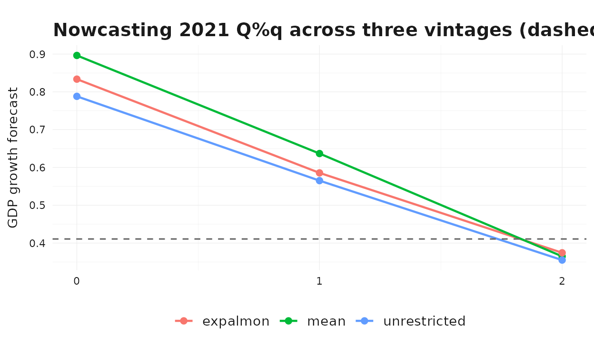
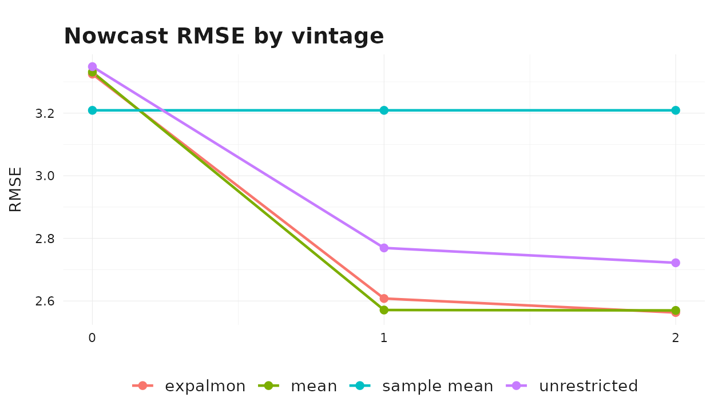
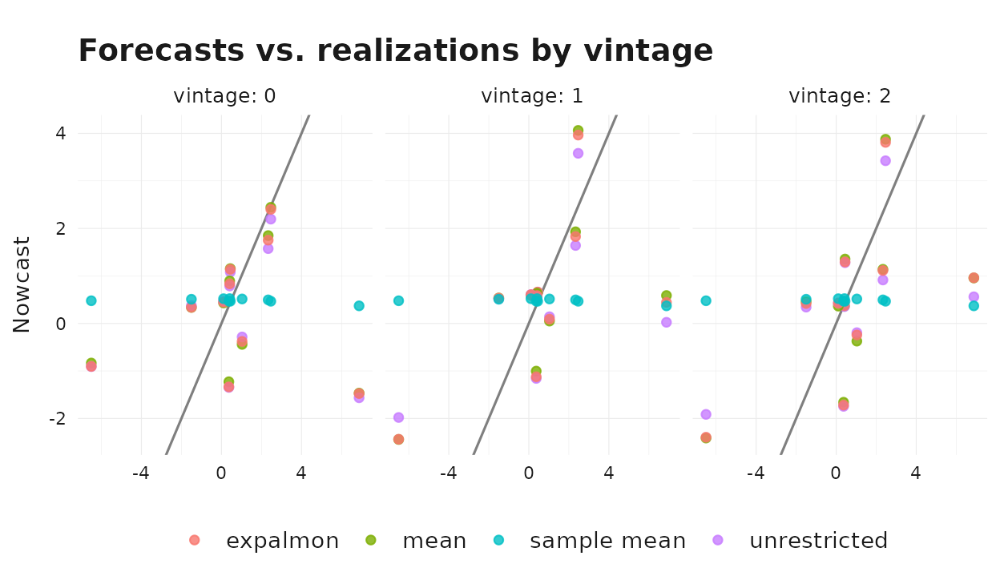

# A Real-Time Nowcasting Exercise

## Why Real-Time Evaluation Matters

In practice, GDP nowcasts are produced repeatedly during a quarter as
new monthly indicator data arrives. A useful nowcast does two things at
once:

1.  It improves as the target quarter unfolds and more indicator data
    becomes available.
2.  It beats simple benchmarks built only from past target observations.

This vignette walks through that exercise on the package’s Swiss data,
combining quarterly GDP growth with the monthly KOF barometer. It
reproduces the canonical real-time pattern — accuracy improves with the
information set — and compares three aggregation strategies against a
naive sample-mean benchmark.

## Setup

``` r

gdp_growth <- suppressMessages(tsbox::ts_na_omit(tsbox::ts_pc(gdp)))

# Evaluation window: the most recent 10 completed quarters.
n_q <- nrow(gdp_growth)
eval_indices <- (n_q - 11):(n_q - 2)
eval_quarters <- gdp_growth$time[eval_indices]
range(eval_quarters)
#> [1] "2020-01-01" "2022-04-01"
```

For each `target_q` in the evaluation window we want three nowcast
*vintages*:

- **Vintage 0**: at the start of `target_q`, no monthly observations
  inside `target_q` are yet available.
- **Vintage 1**: one month into `target_q`, the first monthly
  observation is available.
- **Vintage 2**: two months in, the first two monthly observations are
  available.

Each vintage uses target history up to `target_q - 1` and the
corresponding indicator slice. We use `indic_predict = "last"` to
extrapolate any remaining within-quarter slots in a cheap, deterministic
way; `auto.arima` would work too at higher cost.

``` r

fit_at_vintage <- function(target_q, vintage, aggregator) {
  train_target <- gdp_growth |>
    dplyr::filter(.data$time < target_q)

  cutoff_month <- target_q %m+% lubridate::period(num = vintage, units = "month")
  train_indic <- baro |>
    dplyr::filter(.data$time < cutoff_month)

  solver <- if (aggregator == "expalmon") {
    list(seed = 1, n_starts = 1, maxiter = 50)
  } else {
    NULL
  }

  mf_model(
    target = train_target,
    indic = train_indic,
    indic_predict = "last",
    indic_aggregators = aggregator,
    target_lags = 1,
    h = 1,
    solver_options = solver
  )
}
```

## A Single-Quarter Illustration

Before running the full loop, look at how a nowcast for one quarter
evolves across vintages.

``` r

demo_q <- eval_quarters[length(eval_quarters) - 2]
demo_truth <- gdp_growth$values[gdp_growth$time == demo_q]

demo_methods <- c("mean", "unrestricted", "expalmon")
demo_rows <- list()
for (m in demo_methods) {
  for (v in 0:2) {
    fit <- fit_at_vintage(demo_q, v, m)
    fc <- as.numeric(forecast(fit)$mean)[[1]]
    demo_rows[[length(demo_rows) + 1]] <- dplyr::tibble(
      method = m, vintage = v, forecast = fc
    )
  }
}
demo_df <- dplyr::bind_rows(demo_rows)

ggplot2::ggplot(
  demo_df,
  ggplot2::aes(x = .data$vintage, y = .data$forecast, color = .data$method)
) +
  ggplot2::geom_line(linewidth = 0.8) +
  ggplot2::geom_point(size = 2) +
  ggplot2::geom_hline(
    yintercept = demo_truth,
    linetype = "dashed",
    color = "grey40"
  ) +
  ggplot2::scale_x_continuous(breaks = 0:2) +
  ggplot2::labs(
    title = paste0(
      "Nowcasting ", format(demo_q, "%Y Q%q"),
      " across three vintages (dashed = realized value)"
    ),
    x = "Vintage (months of indicator observed inside the target quarter)",
    y = "GDP growth forecast"
  ) +
  theme_bridgr()
```



As we move from vintage 0 to vintage 2 the methods generally pull toward
the realized value as more monthly information about the target quarter
becomes available.

## Full Real-Time Loop

Now iterate over the evaluation window, all three vintages, and the
three aggregators.

``` r

methods <- c("mean", "unrestricted", "expalmon")
results <- list()

for (q_idx in seq_along(eval_quarters)) {
  target_q <- eval_quarters[[q_idx]]
  truth <- gdp_growth$values[gdp_growth$time == target_q]
  for (v in 0:2) {
    for (m in methods) {
      fit <- fit_at_vintage(target_q, v, m)
      fc <- as.numeric(forecast(fit)$mean)[[1]]
      results[[length(results) + 1]] <- dplyr::tibble(
        target_q = target_q,
        vintage = v,
        method = m,
        forecast = fc,
        actual = truth,
        error = fc - truth
      )
    }
  }
}

# Sample-mean benchmark: prevailing-mean of in-sample target growth.
for (q_idx in seq_along(eval_quarters)) {
  target_q <- eval_quarters[[q_idx]]
  truth <- gdp_growth$values[gdp_growth$time == target_q]
  bench <- mean(gdp_growth$values[gdp_growth$time < target_q])
  for (v in 0:2) {
    results[[length(results) + 1]] <- dplyr::tibble(
      target_q = target_q,
      vintage = v,
      method = "sample mean",
      forecast = bench,
      actual = truth,
      error = bench - truth
    )
  }
}

results_df <- dplyr::bind_rows(results)
```

## Method × Vintage Scoreboard

``` r

scoreboard <- results_df |>
  dplyr::group_by(.data$method, .data$vintage) |>
  dplyr::summarise(
    rmse = sqrt(mean(.data$error^2)),
    mae = mean(abs(.data$error)),
    .groups = "drop"
  ) |>
  dplyr::arrange(.data$method, .data$vintage)

scoreboard
#> # A tibble: 12 × 4
#>    method       vintage  rmse   mae
#>    <chr>          <int> <dbl> <dbl>
#>  1 expalmon           0  3.32  2.10
#>  2 expalmon           1  2.61  1.79
#>  3 expalmon           2  2.56  1.91
#>  4 mean               0  3.33  2.10
#>  5 mean               1  2.57  1.77
#>  6 mean               2  2.57  1.92
#>  7 sample mean        0  3.21  2.05
#>  8 sample mean        1  3.21  2.05
#>  9 sample mean        2  3.21  2.05
#> 10 unrestricted       0  3.35  2.14
#> 11 unrestricted       1  2.77  1.85
#> 12 unrestricted       2  2.72  1.97
```

The clearest single chart is RMSE by vintage, with each method as a
separate line.

``` r

ggplot2::ggplot(
  scoreboard,
  ggplot2::aes(x = .data$vintage, y = .data$rmse, color = .data$method)
) +
  ggplot2::geom_line(linewidth = 0.8) +
  ggplot2::geom_point(size = 2) +
  ggplot2::scale_x_continuous(breaks = 0:2) +
  ggplot2::labs(
    title = "Nowcast RMSE by vintage",
    x = "Vintage (months of indicator observed inside the target quarter)",
    y = "RMSE",
    color = NULL
  ) +
  theme_bridgr()
```



Two patterns are typical in this setup:

1.  **Accuracy improves with the information set.** All three indicator-
    based methods see their RMSE fall as the vintage advances, while the
    sample-mean benchmark is flat — it does not use indicator
    information at all.
2.  **Method ranking is sensitive to vintage.** At vintage 0 the simple
    mean aggregator is often competitive because the within-quarter
    shape is fully extrapolated and parametric weights cannot exploit
    information that is not yet observed. At vintages 1 and 2 the
    unrestricted and parametric specifications start to differentiate
    their within-quarter behavior.

## Forecasts vs. Realizations

To put the RMSE numbers into context, plot every (forecast, realization)
pair colored by method and faceted by vintage.

``` r

ggplot2::ggplot(
  results_df,
  ggplot2::aes(x = .data$actual, y = .data$forecast, color = .data$method)
) +
  ggplot2::geom_abline(slope = 1, intercept = 0, color = "grey50") +
  ggplot2::geom_point(alpha = 0.8) +
  ggplot2::facet_wrap(~ .data$vintage, labeller = ggplot2::label_both) +
  ggplot2::labs(
    title = "Forecasts vs. realizations by vintage",
    x = "Realized GDP growth",
    y = "Nowcast"
  ) +
  theme_bridgr()
```



Points closer to the 45-degree line are more accurate forecasts. The
sample-mean benchmark sits on a horizontal cloud — it cannot react to
realized GDP movements at all. The indicator-based methods spread along
the 45-degree line and tighten as the vintage advances.

## Where to Go Next

The exercise above is intentionally lean: one indicator, one horizon, a
short evaluation window, and `indic_predict = "last"` for all vintages.
In a production setup you would typically:

- Add more indicators and combine them in a single
  [`mf_model()`](https://marcburri.github.io/bridgr/reference/mf_model.md)
  call.
- Compare additional `indic_predict` rules such as `"auto.arima"` or
  `"direct"`.
- Use higher `n_starts` for parametric aggregators in the optimizer.
- Extend the evaluation window and score with additional metrics (CRPS,
  directional accuracy, etc.).

The companion vignette
[`vignette("mixed-frequency-modeling", package = "bridgr")`](https://marcburri.github.io/bridgr/articles/mixed-frequency-modeling.md)
discusses the aggregators in more depth, and
[`vignette("uncertainty-and-scenarios", package = "bridgr")`](https://marcburri.github.io/bridgr/articles/uncertainty-and-scenarios.md)
shows how to attach prediction intervals to the nowcasts produced above.
